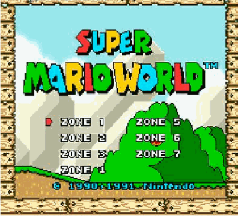

## small SNES-like mosaic effect for [jQuery](http://jquery.com)
This small jQuery plugin simply animates the specified image file with a mosaic effect.

## Requirements

* jQuery
* a browser supporting canvas element (any recent version of IE/FF/Chrome/Safari will have canvas support)

## Usage

    jQuery.('#myImage').mosaic({
        repeat:true
    });

## Demo

Watch SuperMario World with mosaic effect in all its glory [here](http://warpdesign.github.io/jquery-mosaic/index.html "Demo") ;)
